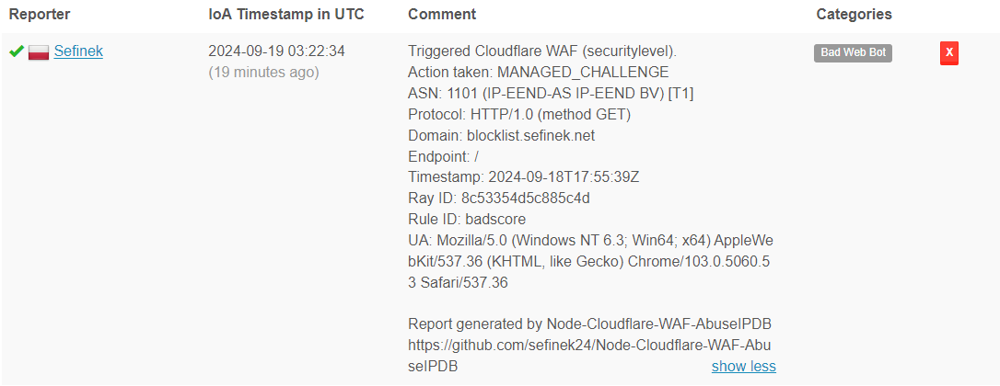
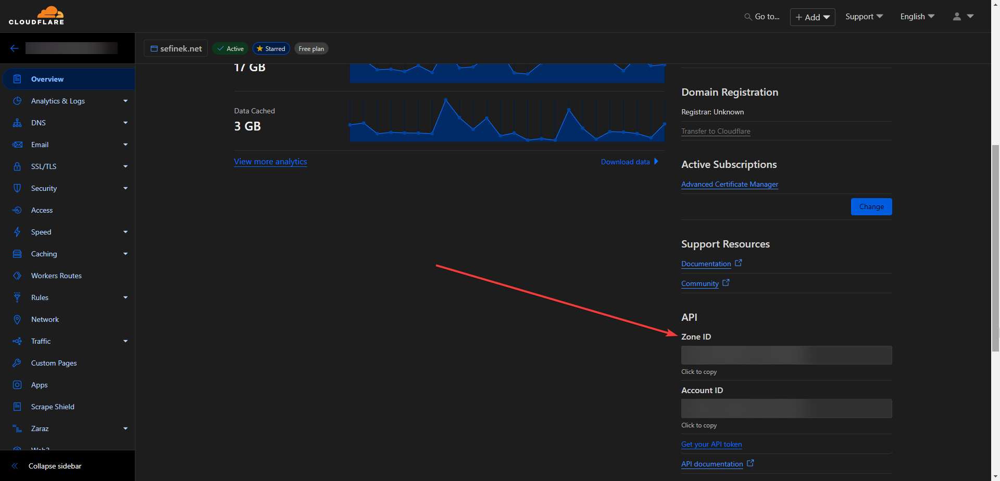
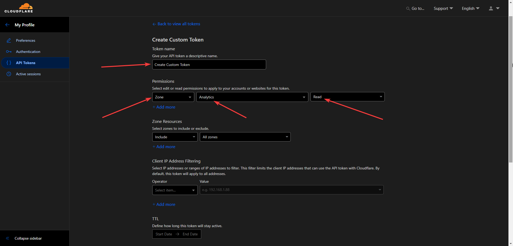

# Cloudflare WAF to AbuseIPDB 🕵️‍♀️
This project offers an automated script that collects and reports IP addresses that have triggered Cloudflare firewall events.
In simple terms, it enables the reporting of incidents detected by Cloudflare WAF to the AbuseIPDB database.

If you're looking for **effective WAF Expressions**, you're in the right place! Check out [sefinek24/Cloudflare-WAF-Expressions](https://github.com/sefinek24/Cloudflare-WAF-Expressions).  
Also, take a look at [sefinek24/UFW-AbuseIPDB-Reporter](https://github.com/sefinek24/UFW-AbuseIPDB-Reporter) for UFW.

> If you like this repository or find it useful, I would greatly appreciate it if you could give it a star ⭐. Thanks a lot!

## 🛠️ Prerequisites
- [Node.js](https://nodejs.org)
- [npm](https://www.npmjs.com) (Node Package Manager)
- [PM2](https://www.npmjs.com/package/pm2) (optional)


## 📃 Information
If you want to make changes to the script from this repository, please kindly [fork](https://github.com/sefinek24/Node-Cloudflare-WAF-AbuseIPDB/fork) it first.


## 🌌 Example Report

```
Triggered Cloudflare WAF (securitylevel).
Action taken: MANAGED_CHALLENGE
ASN: 1101 (IP-EEND-AS IP-EEND BV) [T1]
Protocol: HTTP/1.0 (method GET)
Domain: blocklist.sefinek.net
Endpoint: /
Timestamp: 2024-09-18T17:55:39Z
Ray ID: 8c53354d5c885c4d
Rule ID: badscore
UA: Mozilla/5.0 (Windows NT 6.3; Win64; x64) AppleWebKit/537.36 (KHTML, like Gecko) Chrome/103.0.5060.53 Safari/537.36

Report generated by Node-Cloudflare-WAF-AbuseIPDB https://github.com/sefinek24/Node-Cloudflare-WAF-AbuseIPDB
```

<div align="center">
    My profile: https://www.abuseipdb.com/user/158699
</div>


## 📥 Installation
1. Clone the repository.
   ```bash
   git clone https://github.com/sefinek24/Node-Cloudflare-WAF-AbuseIPDB.git
   ```
2. Install dependencies.
   ```bash
   npm install
   ```
3. Environment variables. Create a new `.env.default` file with the same content, then rename it to `.env`. Fill it with your tokens, etc. Remember to set `NODE_ENV` to `production`!
4. Run the script.
   ```bash
   node .
   ```
5. If you want to run the process 24/7, install the [PM2](https://www.npmjs.com/package/pm2) module.
   ```bash
   npm install pm2 -g
   ```
6. Modify the log paths in the `ecosystem.config.js` file to be correct and existing. You don't need to create `.log` files, just ensure the directory structure is accurate.
7. Run the process continuously using `PM2` to ensure constant operation and automatic restart in case of a failure.
   ```bash
   pm2 start
   ```
8. Save a snapshot of the currently running `Node.js` processes.
   ```bash
   pm2 save
   ```
9. Add `PM2` to startup.
   ```bash
   pm2 startup
   ```
10. Execute the command generated by PM2, e.g.:
   ```bash
   sudo env PATH=$PATH:/usr/bin /usr/lib/node_modules/pm2/bin/pm2 startup systemd -u sefinek --hp /home/sefinek
   ```
11. That’s it! Monitor logs using the `pm2 logs` command.


## 🔤 How to Get Tokens?
### `CLOUDFLARE_ZONE_ID`


### `CLOUDFLARE_API_KEY`
1. Go to [dash.cloudflare.com/profile/api-tokens](https://dash.cloudflare.com/profile/api-tokens).
2. Click the `Create Token` button.
3. Select `Create Custom Token`.
4. 

### `ABUSEIPDB_API_KEY`
Visit [www.abuseipdb.com/account/api](https://www.abuseipdb.com/account/api).


## 😉 Issues and Pull requests
If you need help or have any questions, feel free to create a new [Issue](https://github.com/sefinek24/Node-Cloudflare-WAF-AbuseIPDB/issues). If you'd like to contribute to the project, go ahead and open a [Pull request](https://github.com/sefinek24/Node-Cloudflare-WAF-AbuseIPDB/pulls). Thank you!


## 💕 Credits
This project is inspired by the [MHG-LAB/Cloudflare-WAF-to-AbuseIPDB](https://github.com/MHG-LAB/Cloudflare-WAF-to-AbuseIPDB) repository.
I'm not particularly fond of Python and usually try to avoid using this programming language, which is why I decided to create this repository.


## 📑 MIT License
Copyright 2024 © by [Sefinek](https://sefinek.net). All Rights Reserved.
