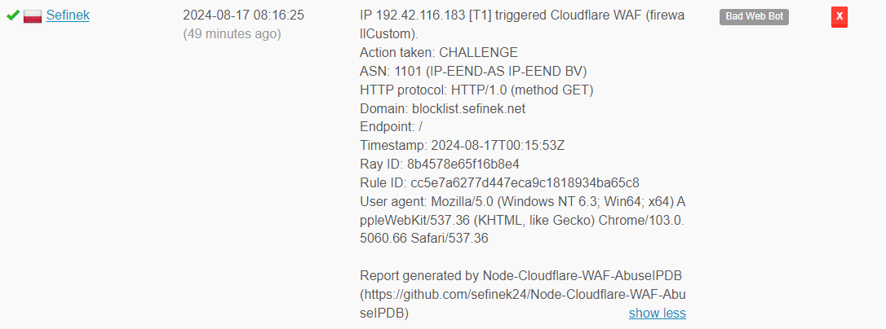

# ☁️ Cloudflare WAF to AbuseIPDB
This project is an automated script designed to fetch and report IP addresses that have triggered specific Cloudflare firewall events.  
It enables reporting incidents detected by Cloudflare WAF to AbuseIPDB.


## 🛠️ Prerequisites
- Node.js
- npm (Node Package Manager)


## 📃 Information
If you want to make changes to the script from this repository, please kindly fork it first.


## 🌌 Example Report

```
IP 192.42.116.183 [T1] triggered Cloudflare WAF (firewallCustom).
Action taken: CHALLENGE
ASN: 1101 (IP-EEND-AS IP-EEND BV)
HTTP protocol: HTTP/1.0 (method GET)
Domain: blocklist.sefinek.net
Endpoint: /
Timestamp: 2024-08-17T00:15:53Z
Ray ID: 8b4578e65f16b8e4
Rule ID: cc5e7a6277d447eca9c1818934ba65c8
User agent: Mozilla/5.0 (Windows NT 6.3; Win64; x64) AppleWebKit/537.36 (KHTML, like Gecko) Chrome/103.0.5060.66 Safari/537.36

Report generated by Node-Cloudflare-WAF-AbuseIPDB (https://github.com/sefinek24/Node-Cloudflare-WAF-AbuseIPDB)
```

> My profile: https://www.abuseipdb.com/user/158699


## 📥 Installation
1. Clone the repository.
   ```bash
   git clone https://github.com/sefinek24/Node-Cloudflare-WAF-AbuseIPDB.git
   ```
2. Install dependencies.
   ```bash
   npm install
   ```
3. Environment variables. Create a new `.env.default` file with the same content, then rename it to `.env`. Fill it with your tokens, etc. Remember to set `NODE_ENV` to `production`!
4. Run the script.
   ```bash
   node .
   ```
5. If you want to run the process 24/7, install the `PM2` module.
   ```bash
   npm install pm2 -g
   ```
6. Modify the log paths in the `ecosystem.config.js` file to be correct and existing. You don't need to create `.log` files, just ensure the directory structure is accurate.
7. Run the process continuously using `PM2` to ensure constant operation and automatic restart in case of a failure.
   ```bash
   pm2 start
   ```
8. Save a snapshot of the currently running `Node.js` processes.
   ```bash
   pm2 save
   ```
9. Add `PM2` to startup.
   ```bash
   pm2 startup
   ```
10. Execute the command generated by PM2, e.g.:
   ```bash
   sudo env PATH=$PATH:/usr/bin /usr/lib/node_modules/pm2/bin/pm2 startup systemd -u sefinek --hp /home/sefinek
   ```
11. That’s it! Monitor logs using the `pm2 logs` command.


## 🔤 How to Get Tokens?
### `CLOUDFLARE_ZONE_ID`


### `CLOUDFLARE_API_KEY`
1. Go to [dash.cloudflare.com/profile/api-tokens](https://dash.cloudflare.com/profile/api-tokens).
2. Click the "Create Token" button.
3. Select "Create Custom Token".
4. 

### `ABUSEIPDB_API_KEY`
Go to [www.abuseipdb.com/account/api](https://www.abuseipdb.com/account/api).


## 💕 Credits
This project is inspired by the [MHG-LAB/Cloudflare-WAF-to-AbuseIPDB](https://github.com/MHG-LAB/Cloudflare-WAF-to-AbuseIPDB) repository.
I'm not particularly fond of Python and usually try to avoid using this programming language, which is why I decided to create this repository.


## 📑 MIT License
Copyright 2024 © by [Sefinek](https://sefinek.net). All Rights Reserved.